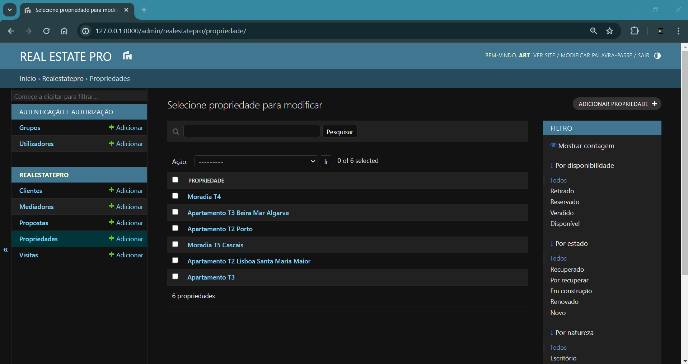

# Real Estate Pro

## Project Description
This is a real estate management system project developed in Portuguese using Django. The application allows users to efficiently manage properties, clients, and agents. It is designed with the goal of providing CRUD (Create, Read, Update, Delete) functionality for all main entities of the system.

### Screenshots



## Technologies Used
 - Django: A high-level web framework for Python that enables rapid and clean web development.
 - HTML/CSS: Fundamental technologies for the development of the system's user interface.
 - Bootstrap: A front-end framework for responsive and mobile-first web development.
 - SQLite: A lightweight and widely used relational database management system, which is the default database of Django.

## Features
 - CRUD Application: The application offers complete CRUD operations for the main entities of the system, including properties, clients, and agents.
 - Automatic Agent Assignment: If an agent is not specified during the creation of a property, the system automatically assigns the currently authenticated user as the responsible agent.
 - Auto-generated IDs: Property and client IDs are auto-generated, ensuring uniqueness and facilitating system management. IDs can also be manually updated if needed.

## Running the Project
To run the project locally, follow these steps:

# 1. Clone the repository:
    ```bash
    git clone https://github.com/Estela-Ricardo/cmsER
    ```

# 2.  (optional) Create and activate a virtual environment:
    ```bash
    # Create a virtual environment in the project folder
    python -m venv myenv

    # Activate the virtual environment on Windows
    myenv\Scripts\activate

    # Activate the virtual environment on Linux/Mac
    source myenv/bin/activate
    ```

# 3. Navigate to the project directory:

    ```bash
    cd cmsER
    ```

# 4. Install the project dependencies using the requirements.txt file:

    ```bash
    pip install -r requirements.txt
    ```

# 6. Create initial database migrations:    

    ```bash
    python manage.py makemigrations
    ```

# 7. Apply migrations to the database:

    ```bash
    python manage.py migrate
    ```

# 8. Create a superuser (admin) for the Django admin interface:

    ```bash
    python manage.py createsuperuser
    ```

# 9. Start the development server:

    ```bash
    python manage.py runserver
    ```

# 10. Open a web browser and navigate to: 

    ```bash
    http://127.0.0.1:8000/admin/
    ```

## Contribution

Contributions are welcome! Feel free to open an issue or submit a pull request with suggestions for improvements, bug fixes, or new features.

## License

This project is licensed under the MIT License - see the [LICENSE](LICENSE) file for details.

---
Developed by [Estela Ricardo](https://github.com/Estela-Ricardo)
